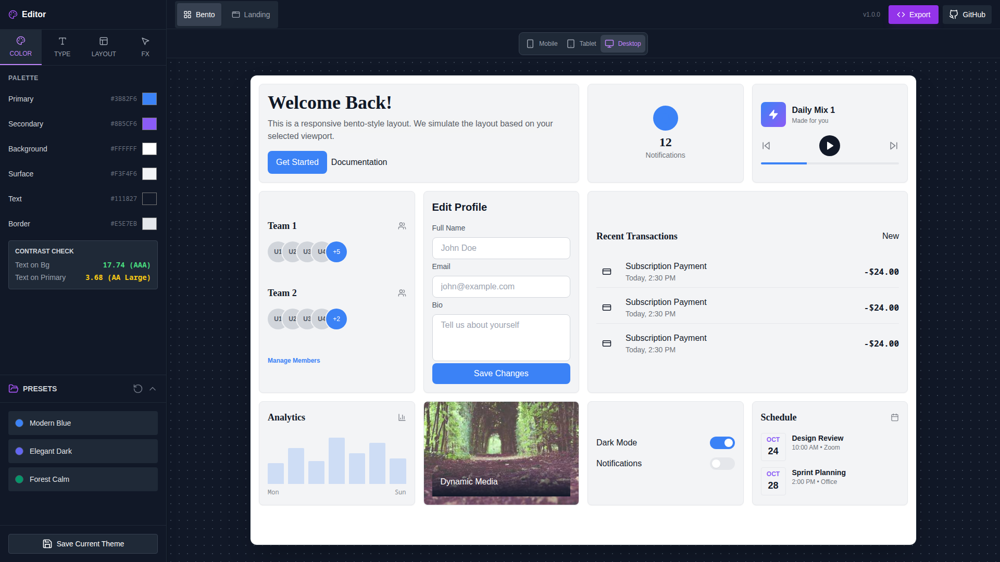

# CSS Sandbox Pro

[](LICENSE)
[](https://vitejs.dev/)
[](https://react.dev/)
[](https://www.typescriptlang.org/)
[](https://tailwindcss.com/)

<p align="center">
    
</p>

<p align="center">
    <b>Professional, responsive, and accessible CSS visual editor for design tokens and live preview.</b>
</p>

---

## 🚀 Demo

- **Live Demo:** [css-sandbox on GitHub Pages](https://danielgofu.github.io/css-sandbox/)
- **Repository:** [github.com/Danielgofu/css-sandbox](https://github.com/Danielgofu/css-sandbox)

---

## ✨ Features

- **Mobile-First Design:** Fully responsive interface, from mobile (stacked) to desktop (multi-pane).
- **Real-time Preview:** Instantly see changes on a Bento Grid or Landing Page.
- **Visual Editor:** Controls for Colors, Typography, Layout, and Effects.
- **Accessibility First:** Built-in WCAG Contrast checker, semantic HTML, and ARIA attributes.
- **Export:** Generate production-ready CSS variables, Tailwind config, or JSON.
- **Preset Management:** Save/Load themes via LocalStorage.
- **SEO & Social:** Meta tags, Open Graph, Twitter, and JSON-LD structured data.
- **Security:** CSP, HSTS, X-Frame-Options, X-Content-Type-Options, and input hygiene.

---

## 📦 Tech Stack

- [React 19](https://react.dev/)
- [TypeScript](https://www.typescriptlang.org/)
- [Tailwind CSS](https://tailwindcss.com/)
- [Lucide React (Icons)](https://lucide.dev/)
- [Vite](https://vitejs.dev/)

---

## 🛠️ Installation

Clone the repository and install dependencies:

```bash
git clone https://github.com/Danielgofu/css-sandbox.git
cd css-sandbox
npm install
```

Start the development server:

```bash
npm run dev
```

---

## 📱 Mobile Testing

1. Open Chrome DevTools (`F12`).
2. Toggle Device Toolbar (`Ctrl+Shift+M`).
3. Select a device (e.g., "iPhone 12").
4. Verify the layout stacks vertically (Header → Preview → Editor) and touch targets are accessible (min 44px).

---

## 🧩 Usage

1. Use the visual controls to adjust colors, typography, layout, and effects.
2. Preview changes in real-time on the Bento Grid or Landing Page.
3. Export your theme as CSS variables, Tailwind config, or JSON.
4. Save/load your favorite themes as presets (stored in LocalStorage).

---

## 🧪 Testing

Run tests with:

```bash
npm test
```

---

## 🤝 Contributing

Contributions, issues, and feature requests are welcome!

1. Fork the repository
2. Create your feature branch (`git checkout -b feature/YourFeature`)
3. Commit your changes (`git commit -am 'Add new feature'`)
4. Push to the branch (`git push origin feature/YourFeature`)
5. Open a pull request

---

## 📄 License

This project is licensed under the MIT License. See the [LICENSE](LICENSE) file for details.

---

## 🌐 Links & Resources

- [Live Demo](https://danielgofu.github.io/css-sandbox/)
- [GitHub Repository](https://github.com/Danielgofu/css-sandbox)
- [Issues](https://github.com/Danielgofu/css-sandbox/issues)
- [Pull Requests](https://github.com/Danielgofu/css-sandbox/pulls)
- [Docs](docs/index.html)

---

<p align="center">
    <i>Made with ❤️ by <a href="https://github.com/Danielgofu">Danielgofu</a></i>
</p>

---

## 👤 Autor y Portafolio

- Hecho por [Danielgofu](https://github.com/Danielgofu)
- Portafolio: [danielgofu.dev](https://danielgofu.dev)